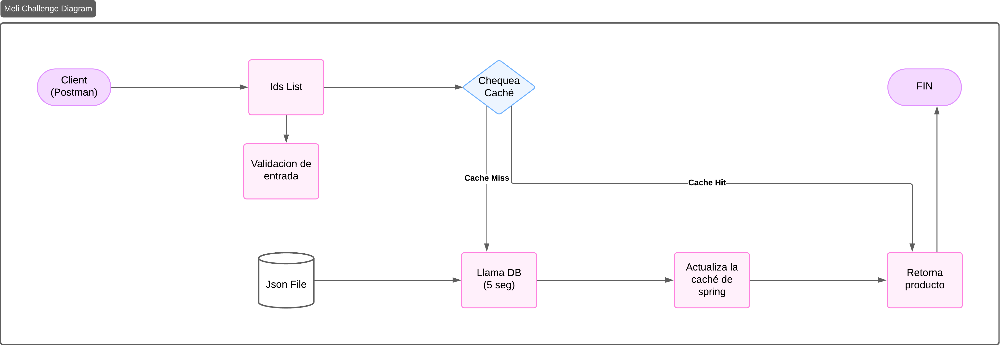

## 🚀 Cómo Empezar y Ejecutar

Para obtener instrucciones detalladas sobre cómo configurar y ejecutar el proyecto, por favor, haz clic aquí:

**[Guía de Ejecución (run.md)](run.md)**

## Breve Descripción

Para resolver este challenge decidí usar una arquitectura hexagonal ya que permite desacoplar completamente la
lógica de negocio de cualquier framework o base de datos. Cree un solo endpoint principal /v1/products/compare

El principal desafío que me enfrenté era como mi sistema iba a soportar multiples solicitudes al
mismo tiempo sin bloquear el sistema, por eso decidí usar spring webflux en lugar de una api Restful donde
básicamente con cada solicitud se bloquea la app y el cliente tiene que esperar a que se completen las operaciones,
como llamado a base de datos por ejemplo u otra API.

Implementé un pequeño mecanismo de caching para mejorar el rendimiento, utilizando herramientas de SpringBoot, en un escenario real hubiera
usado Redis o HazelCast. Lo que hice fue guardar cada elemento individualmente en la caché asi cuando el cliente realizara una
petición con varios elementos, siempre intenta buscar primero en la caché, si no recupera el elemento del archivo json.
Además, le puse un delay a cada solicitud en caso de que tenga que buscar en este archivo,
simulando asi el tiempo que tarda en recuperar esta información y asi aprovechar el caching al maximo.

Para la seguridad implementé una API key con spring Security por una cuestión de simplicidad.
En un escenario real hubiera usado OAuth2 con jwt. 

He utilizado Spring validation para validar los datos de entrada a la API. Además, he implementado un @RestControllerAdvice para manejar 
las excepciones de manera centralizada

## Diagrama:

## Endpoint Principal:
    Post localhost:8080/v1/products/compare

#### Body Example
    { "ids": ["5", "6", "7", "8"] }

### APY KEY (Debe ir en el header)
    X-API-Key = MELI_CHALLENGE

### Tecnologías Usadas
- java 21
- Springboot
- WebFlux
- Gradle (kotlin)
- Spring Security
- Mockito
- Docker
